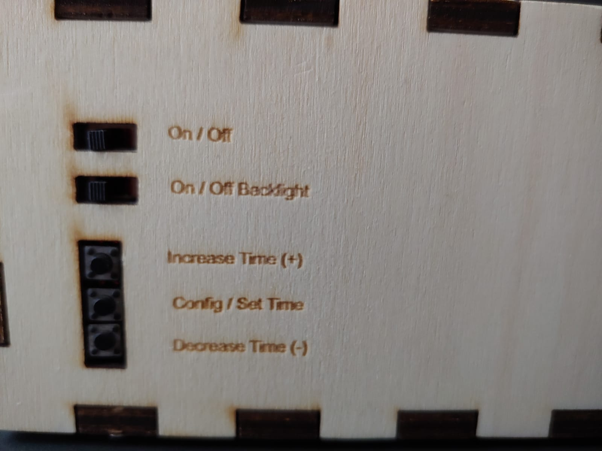

# GirlfriendBox_Present
This is a self-made present for your girlfriend or wife.

<p align="center">
  
  
</p>

It is a box, that counts how long you have been together or married in different units. It cycles through seconds, minutes, hours, days, months, years as well as a customizable text, that shows your “Date”. Additionally, it also displays the current date & time at the bottom of the display. 

The project idea is inspired by this [video](https://www.youtube.com/watch?v=PbRNsSK7r4M), but the code as well as the box were created by myself.

## What you need
- 1 Arduino, which is the "brain". I used the [Arduino Nano V3](https://store.arduino.cc/arduino-nano)
- 1 Real-Time-Clock Module, which keeps track of the time. I used the [DS3231](https://create.arduino.cc/projecthub/MisterBotBreak/how-to-use-a-real-time-clock-module-ds3231-bc90fe)
- 1 [I2C-LCD-Display](https://www.amazon.de/SainSmart-Character-Display-Mega2560-Duemilanove/dp/B007XRHBKA/ref=sr_1_5?__mk_de_DE=%C3%85M%C3%85%C5%BD%C3%95%C3%91&keywords=lcd+display+20+4&qid=1584369187&sr=8-5) with 20 * 4 characters
- 3 [Buttons](https://www.amazon.de/Youmile-100er-Pack-Miniatur-Mikro-Taster-Tastschalter-Qualit%C3%A4tsschalter-Miniature-6-x-5-mm/dp/B07Q1BXV7T/ref=sr_1_10?__mk_de_DE=%C3%85M%C3%85%C5%BD%C3%95%C3%91&keywords=arduino+buttons&qid=1584369131&sr=8-10) to set the current time
- 2 [Switches](https://www.digikey.de/product-detail/de/e-switch/EG1201A/EG1902-ND/101723?utm_adgroup=Slide%20Switches&utm_source=google&utm_medium=cpc&utm_campaign=Google%20Shopping_Switches&utm_term=&productid=101723). The first is for power and the second for the backlicht of the display
- Optionally
  - 1 [Lipo-Battery](https://www.amazon.de/gp/product/B07XCRTXL9/ref=ppx_yo_dt_b_asin_title_o00_s00?ie=UTF8&psc=1), so that you don't require always a power cable. I used a model with 3.7V and 2600mAh
  - 1 [Lipo-Charging-Circuit](https://www.amazon.de/IZOKEE-TP4056-Lademodul-Lithium-Batterie-Charger/dp/B077XW1XBJ/ref=sr_1_55?__mk_de_DE=%C3%85M%C3%85%C5%BD%C3%95%C3%91&keywords=lipo+batterie+3.7V&qid=1584368795&sr=8-55&swrs=DA54B589F4D9CA14229DFFDA2D1A5500), so that you can charge the battery 
  - 1 [Boost-Converter](https://www.amazon.de/gp/product/B07KW61VYM/ref=ppx_yo_dt_b_asin_title_o00_s00?ie=UTF8&psc=1), which increases the battery voltage to 7 Volts
  - Some soldering gear, if you want to make a nice PCB

## Build the circuit
<p align="center">
  
</p>
To build the circuit gather all the components and create the wiring according to the scheme provided in the “wiring_diagram” folder. Configure the boost-converter to output 7V. You can do this with a multimeter. Connect the probes to the + Pin  and - Pin of the boost-converter and measure the voltage. Rotate the potentiometer on the boost-convert until the multimeter shows 7V.

Note that this diagram contains only one switch for the power. The second is connected to the backlight pins of the I2C-Display. And now you are already done with the circuit :D yeahh 

Optionally you can create a small PCB for the wiring. This makes the assembly much cleaner. Additionally, I recommend using plugs between the components. This makes the assembly and/or maintenance if something breaks much more easy.

## Upload the code
After creating the circuit open the “girlfriendbox.ino” file with the Arduino IDE or something similar. Add the required libraries from the “lib” folder. In the Arduino IDE you can do this by clicking Sketch > Include Library > Add .ZIP Library. 
Now you should be able to upload the code to the Arduino and the program should run.

```C++
#define START_TIME_OF_COUNTER_TEXT "23.05.2019"
#define START_TIME_OF_COUNTER_UNIX_TIMESTAMP 1558569600
#define START_TIME_YEAR 2019
#define START_TIME_MONTH 5
#define START_TIME_DAY 23
```
The first one is the date shown on the display, the second is the same date as unix-timestamp, which is used to calculate the passed seconds, minutes, hours and days. You can use any online converter to get this timestamp. Note: You should add an offset for your timezone. So if you are in timezone +1 and your date is “23.05.2019 00:00” calculate the timestamp with “23.05.2019 01:00”. Last, add the date values for the day, month and year field. Personally I would prefer to calculate these values, but this would be a really big pain and soooo I ignored it... Anyways these are used to calculate the passed months and years, and of course, they only change on the monthly and yearly anniversary. 

Now you can change some more minor details, like the welcome text which will be shown initally and the units for seconds, month, ... , year if you prefer a different language. 

Upload the code to the arduino and set the current date and time. You can do this by pressing the config button (Pin 3). Increase and decrease the values with the buttons on Pin 4 and 5. If the value ist correct press the config button again.

## Build the case
Of course, you need a case for your box. I created one out of 6mm wood with the help of a laser cutter. If you have access to one of these, you can use the .dxf file in the folder “lasercutter_files”. If not, you have to manually cut/saw a box or you search for a company that will do this for you.

<p align="center">
  
  
</p>
If you have your box, you must do some “post processing”. The .dxf file doest not include a hole for the charging-circuit, so you must create it manually. Screw the display in place and fixate the buttons and switches at the back of the case. I used a good amount of hot glue for that. To fixate the Lipo-battery I used some Velcro tape.

If all the components are securely mounted, close the box with some wood screws. This allows you to open it, if something is broken.
And now you are done and have a great present :D 
